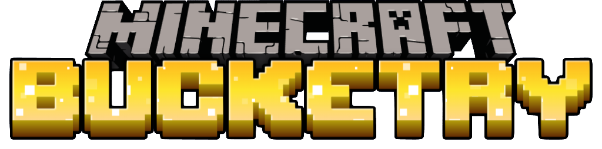
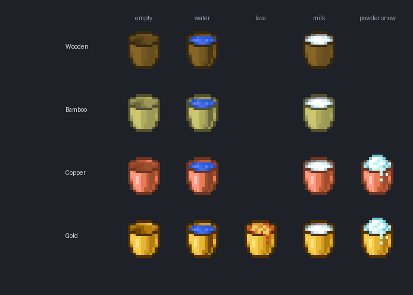

**The bucket progression vanilla never finished.**

*A vanilla-first tier ladder for buckets: a cheap wooden one, a tougher bamboo one, a permanent copper one, a versatile gold one that handles lava — and a quietly revised iron recipe.*

> ⚠️ Targets **Minecraft 26.2**. Won't load on earlier versions.

---

## Why this mod

Vanilla has exactly one bucket. You either have iron, or you have nothing — there's no early-game bucket and no reason to ever craft a second kind. Bucketry fills that one missing piece with a small, readable **tier ladder** that looks like it could have shipped with the base game: wood early, bamboo as a sturdier alternative, copper as a permanent mid-tier, gold as a versatile late-game option that's the only bucket capable of carrying lava, and iron unchanged except for a recipe tweak.

No HUD spam, no menus, no new ores. Just buckets that behave the way you'd expect.

---

## The tiers

| Tier | Material | Durability | Empty stacks to | Lava | Powder snow |
|---|---|:-:|:-:|:-:|:-:|
| 🪣 **Wooden** | 5 planks | ~16 uses, then breaks | 1 | — | — |
| 🎋 **Bamboo** | 5 bamboo planks | ~32 uses, then breaks | 1 | — | — |
| 🟠 **Copper** | 5 copper ingots | **permanent** (never breaks) | **16** | — | ✅ |
| 🥇 **Gold** | 5 gold ingots | ~32 uses, then breaks | 1 | ✅ | ✅ |
| ⚙️ **Iron** *(vanilla)* | 5 iron ingots | permanent | 16 | — | ✅ |

- **🪣 Wooden** — the cheapest way to carry water. Light and disposable: ~16 uses before it breaks. Great for your first nether trip or an early farm.
- **🎋 Bamboo** — looks and works like wood, but **twice as tough** (~32 uses). A natural step up if you have a bamboo farm before you have spare iron.
- **🟠 Copper** — the mid-tier sweet spot. Like iron it's **permanent** (no durability, never breaks) and the empty bucket **stacks to 16**, and like iron it can **scoop powder snow**. Cheaper than iron, and it doesn't oxidise (matching vanilla copper tools).
- **🥇 Gold** — the specialist. Same 32-use durability as bamboo, but it's the **only bucket that can hold lava** — ideal for nether builds or moving lava lakes. Also carries water, milk, and powder snow.
- **⚙️ Iron** — the unmodified vanilla bucket. Only its **recipe** changes (see below); behaviour is 100% vanilla.

---

## Variants

Every tier comes as an **empty**, a **water**, and a **milk** bucket. Copper and gold additionally have a **powder snow** bucket. Gold uniquely adds a **lava** bucket.

| Variant | How you get it |
|---|---|
| **Empty** | Craft it (see recipes). |
| **Water** | Right-click a water source with the empty bucket. |
| **Lava** | Right-click a lava source with an empty **gold** bucket (gold only). |
| **Milk** | Right-click a cow with the empty bucket — drink it to clear effects, just like vanilla milk. |
| **Powder snow** *(copper & gold)* | Right-click powder snow with an empty **copper** or **gold** bucket; right-click to place it back. |

For wood, bamboo, and gold, filling, milking and emptying all draw from the **same durability pool** — a milk run wears the bucket just like a water run.

---

## Recipes

Every craftable bucket shares one shape: **five pieces of a single material in a V** — no chains. Same silhouette, five materials.

| Wooden | Bamboo |
|:-:|:-:|
|  |  |
| **Copper** | **Gold** |
|  |  |
| **Iron** *(revised)* | |
|  | |

**Why the iron recipe changes:** vanilla's bucket shares its `▢ ▢ / ▢` shape with nothing in particular, but the new mod buckets all use the five-in-a-V layout — so iron joins them (5 iron ingots) for a consistent family and to keep the simple `▢ ▢ / ▢` arrangement free for the wooden bowl. The override ships two ways for robustness: a runtime recipe rewrite on NeoForge and a static datapack recipe on Fabric.

> The water, lava, milk and powder-snow variants are **not** crafted — you obtain them in-world (fill / milk / scoop).

---

## Mechanics in detail

**Durability & repair (wood, bamboo, gold).** These use real vanilla durability: they show the normal durability bar, wear down with use, and break when exhausted. Because they're genuine damageable items you can **repair them by combining two damaged buckets of the same type in the crafting grid** — exactly like repairing a pickaxe. (Being damageable, they don't stack — one per slot.)

**Permanence & stacking (copper, iron).** Copper has no durability at all — it never breaks, never needs repair, and the **empty bucket stacks to 16** so you can haul a column of them.

**Lava (gold only).** The gold bucket is the only tier that can scoop lava. Right-click any lava source block to fill it; right-clicking a target block empties it and returns the worn empty gold bucket. This makes gold essential for nether infrastructure work.

**Powder snow (copper, gold).** The empty copper or gold bucket scoops powder snow and places it back — wood and bamboo hold water only.

**Milk.** Right-click any cow with a wood/bamboo/copper/gold empty bucket to get the matching milk bucket; drinking clears status effects like vanilla. For durable tiers, milking and drinking share the same durability pool as water use.

---

## Under the hood

- **Two loaders, no Architectury.** NeoForge **and** Fabric, each a self-contained project, logic mirrored rather than shared — a deliberate choice for the bleeding-edge 26.x toolchain.
- **Minecraft 26.2** (Mojang official names, post-deobfuscation).
- **30 language translations** included; `en_us` is canonical and the rest are full translations (French uses « seau »).
- Textures are generated from vanilla references by a committed pipeline (`tools/`), and a Python resource validator (`tests/validate.py`) gates every build.

---

### Install & build → see [README.md](./README.md)

Part of the **[Minecraft Revamp](../README.md)** collective — small, focused mods that modernise Minecraft without denaturing it.

Made by [@JessicaMalle](https://github.com/JessicaMalle) with assistance from Claude.

