

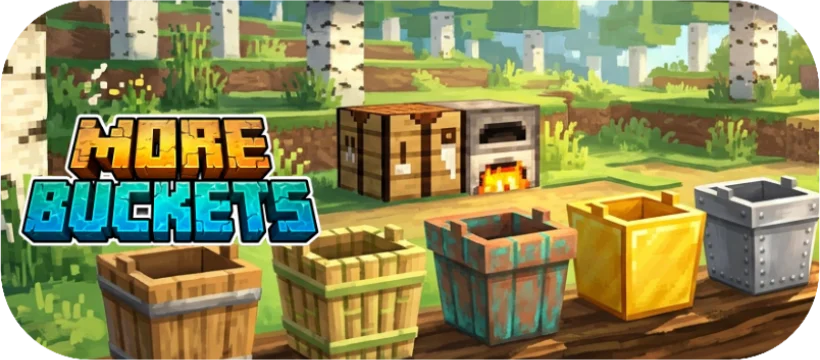

**The bucket progression vanilla never finished.**

*A vanilla-first tier ladder for buckets: a cheap wooden one, a tougher bamboo one, a permanent copper one, a versatile gold one that handles lava — and a quietly revised iron recipe.*

> ⚠️ Targets **Minecraft 26.2**. Won't load on earlier versions.

---

## Why this mod

Vanilla has exactly one bucket. You either have iron, or you have nothing — there's no early-game bucket and no reason to ever craft a second kind. Bucketry fills that one missing piece with a small, readable **tier ladder** that looks like it could have shipped with the base game: wood early, bamboo as a sturdier alternative, copper as a permanent mid-tier, gold as a versatile late-game option — the only *added* bucket capable of carrying lava, matching vanilla iron — and iron unchanged except for a recipe tweak.

No HUD spam, no menus, no new ores. Just buckets that behave the way you'd expect.

---

## The Tiers

Here is a summary of the bucket progression:

| Tier | Icon | Material | Durability | Empty stacks to | Lava | Powder snow |
| :---: | :---: | :--- | :---: | :---: | :---: | :---: |
| **Wooden** | 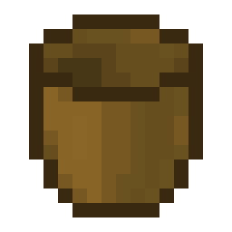 | 5 Planks | ~16 uses | 1 | — | — |
| **Bamboo** | 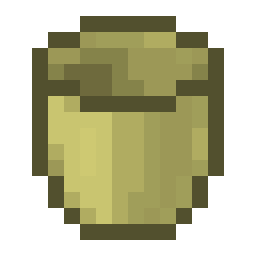 | 5 Bamboo Planks | ~32 uses | 1 | — | — |
| **Copper** | 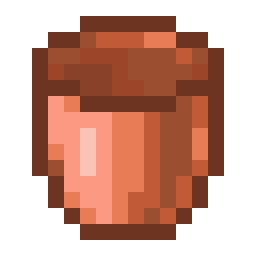 | 5 Copper Ingots | **permanent** | **16** | — | ✅ |
| **Gold** | 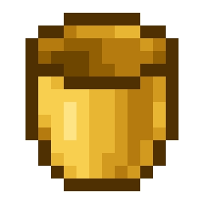 | 5 Gold Ingots | ~32 uses | 1 | ✅ | ✅ |
| **Iron** | 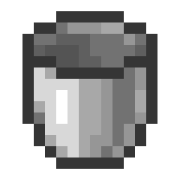 | 5 Iron Ingots | **permanent** | 16 | ✅ | ✅ |

---

## Tier Showcase

### 🪣 Wooden Tier
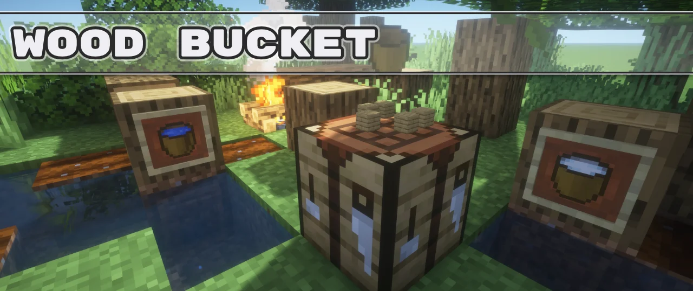

*The cheapest way to carry water. Light, disposable, and easy to craft in the early game.*

* **Durability:** ~16 uses (breaks when exhausted).
* **Stacking:** Does not stack (1 per slot).
* **Lava:** Cannot hold lava (will not scoop).

| Variant | Icon | How to Obtain / Behavior |
| :--- | :---: | :--- |
| **Wooden Bucket** |  | Crafted with 5 planks in a V-shape. |
| **Wooden Water Bucket** | 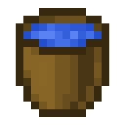 | Filled by right-clicking a water source. |
| **Wooden Milk Bucket** | 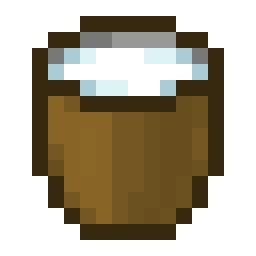 | Obtained by right-clicking a cow. Drink to clear status effects. |

---

### 🎋 Bamboo Tier
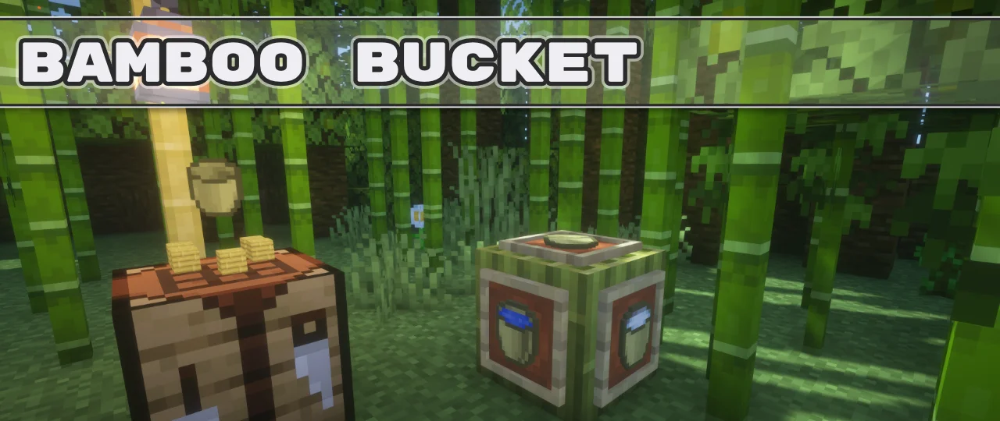

*Twice as tough as standard wood, presenting a sturdier early-game choice.*

* **Durability:** ~32 uses (twice the durability of wood).
* **Stacking:** Does not stack (1 per slot).
* **Lava:** Cannot hold lava.

| Variant | Icon | How to Obtain / Behavior |
| :--- | :---: | :--- |
| **Bamboo Bucket** |  | Crafted with 5 bamboo planks in a V-shape. |
| **Bamboo Water Bucket** | 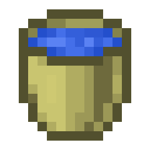 | Filled by right-clicking a water source. |
| **Bamboo Milk Bucket** | 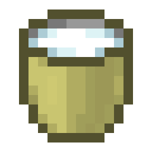 | Obtained by right-clicking a cow. Drink to clear status effects. |

---

### 🟠 Copper Tier
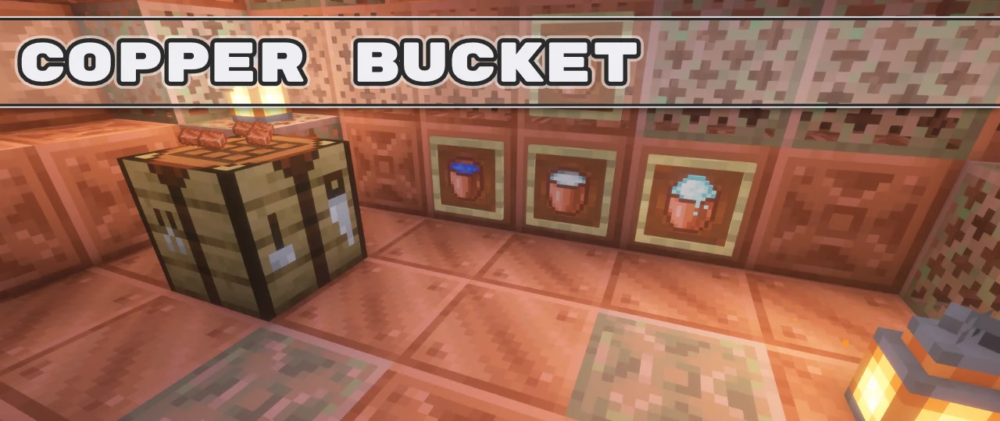

*The perfect mid-tier sweet spot. Highly durable, stackable, and capable of scooping powder snow.*

* **Durability:** **Permanent** (never breaks).
* **Stacking:** Empty buckets stack up to **16**.
* **Lava:** Cannot hold lava.
* **Powder Snow:** Can scoop, carry, and place powder snow.

| Variant | Icon | How to Obtain / Behavior |
| :--- | :---: | :--- |
| **Copper Bucket** |  | Crafted with 5 copper ingots in a V-shape. |
| **Copper Water Bucket** | 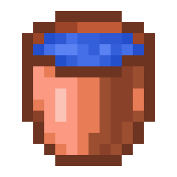 | Filled by right-clicking a water source. |
| **Copper Milk Bucket** | 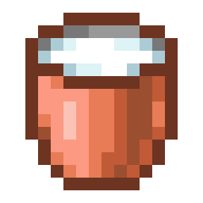 | Obtained by right-clicking a cow. |
| **Copper Powder Snow Bucket** | 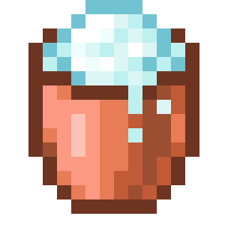 | Obtained by right-clicking powder snow. |

---

### 🥇 Gold Tier
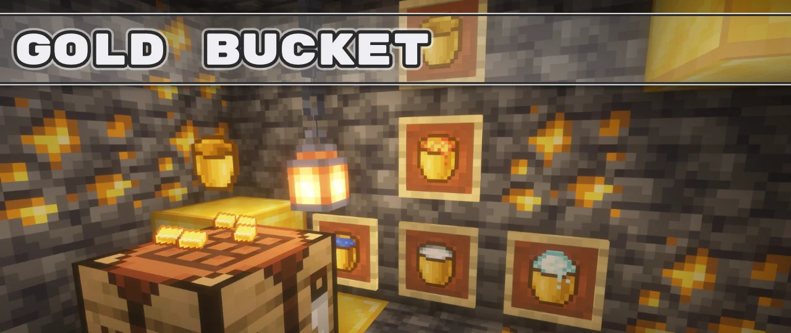

*The specialist. It's the only added bucket tough and thermally insulated enough to transport lava.*

* **Durability:** ~32 uses (wear is applied by filling, emptying, and milking).
* **Stacking:** Does not stack (1 per slot).
* **Lava:** **Capable of holding and placing lava.**
* **Powder Snow:** Can scoop, carry, and place powder snow.

| Variant | Icon | How to Obtain / Behavior |
| :--- | :---: | :--- |
| **Gold Bucket** |  | Crafted with 5 gold ingots in a V-shape. |
| **Gold Water Bucket** | 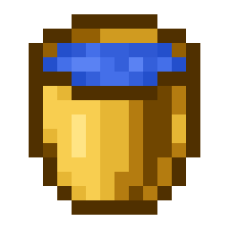 | Filled by right-clicking a water source. |
| **Gold Lava Bucket** | 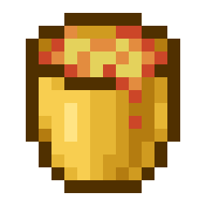 | Obtained by right-clicking a lava source. |
| **Gold Milk Bucket** | 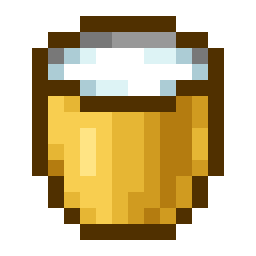 | Obtained by right-clicking a cow. |
| **Gold Powder Snow Bucket** | 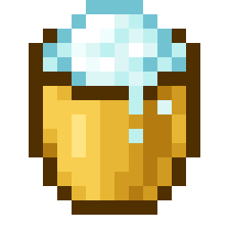 | Obtained by right-clicking powder snow. |

---

### ⚙️ Iron Tier *(Vanilla)*
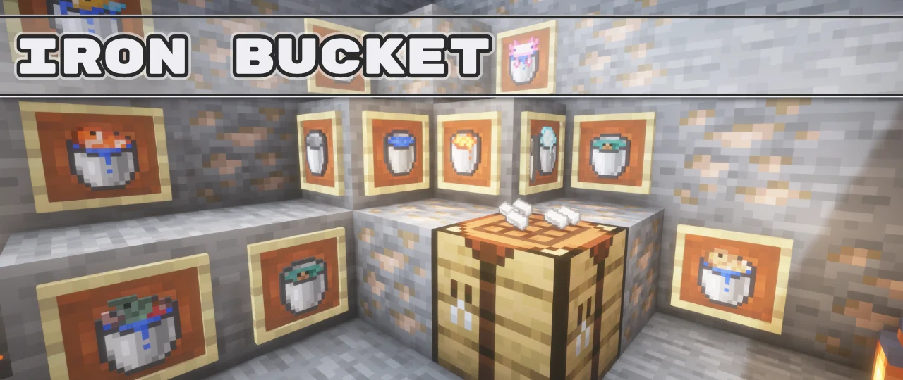

*The classic vanilla bucket. Retains all original traits, but uses a revised recipe for visual consistency.*

* **Durability:** **Permanent** (never breaks).
* **Stacking:** Empty buckets stack up to **16**.
* **Lava:** Capable of holding and placing lava.
* **Powder Snow:** Can scoop, carry, and place powder snow.

| Variant | Icon | How to Obtain / Behavior |
| :--- | :---: | :--- |
| **Iron Bucket** |  | Crafted with 5 iron ingots (V-shape). |
| **Iron Water Bucket** | 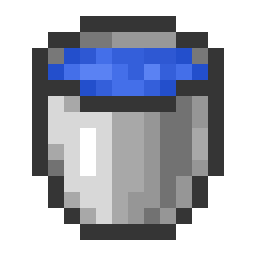 | Filled by right-clicking a water source. |
| **Iron Lava Bucket** | 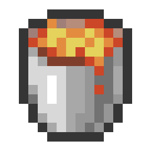 | Obtained by right-clicking a lava source. |
| **Iron Milk Bucket** | 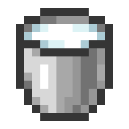 | Obtained by right-clicking a cow. |
| **Iron Powder Snow Bucket** | 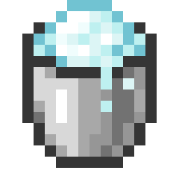 | Obtained by right-clicking powder snow. |

---

## Crafting Recipes

Every craftable bucket now shares a consistent recipe layout: **five pieces of a single material in a V shape** — no chains.

| Tier | Crafted Bucket | Recipe Pattern |
| :---: | :---: | :---: |
| **Wooden** |  | 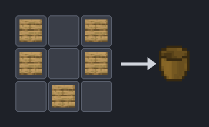 |
| **Bamboo** |  | 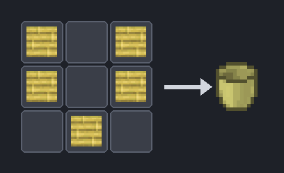 |
| **Copper** |  | 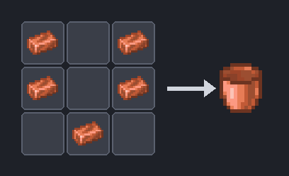 |
| **Gold** |  | 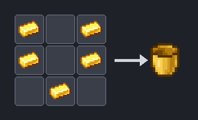 |
| **Iron** *(revised)* |  | 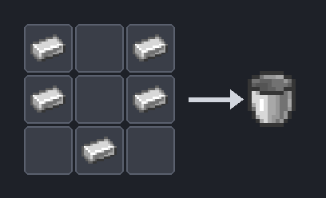 |

**Why the iron recipe changes:** Vanilla's bucket recipe (`▢ ▢ / ▢`) is inconsistent with the other tiers. Changing it to require **5 iron ingots** in a V-shape creates a cohesive visual and progression logic across all materials.

---

## Mechanics in Detail

* **Durability & Repair:** Wood, bamboo, and gold buckets are damageable items that display the standard vanilla durability bar. They wear down with use and break when exhausted. You can **repair them by combining two damaged buckets of the same type in the crafting grid** — exactly like repairing armor or tools. Since they can hold damage values, they do not stack.
* **Permanence & Stacking:** Copper and iron buckets have no durability, never break, and their empty forms stack up to **16** in a single inventory slot.
* **Lava Transport:** Only gold and vanilla iron buckets are capable of holding lava. Right-clicking a lava block with wood, bamboo, or copper will have no effect.
* **Powder Snow:** Copper and gold join iron in their ability to scoop up powder snow blocks and place them back in the world.
* **Milk:** Any empty bucket can be used to milk a cow. Drinking the milk clears all status effects. For durable tiers, milking and drinking draw from the bucket's durability pool.

---

## Under the Hood

- **Two loaders, no Architectury:** NeoForge **and** Fabric, each a self-contained project, logic mirrored rather than shared — a deliberate choice for the bleeding-edge 26.x toolchain.
- **Minecraft 26.2** (Mojang official names, post-deobfuscation).
- **30 language translations** included; `en_us` is canonical and the rest are full translations (French uses « seau »).
- Textures are generated from vanilla references by a committed pipeline (`tools/`), and a Python resource validator (`tests/validate.py`) gates every build.

---

### Install & build → see [README.md](./README.md)

Part of the **[Minecraft Revamp](../README.md)** collective — small, focused mods that modernise Minecraft without denaturing it.

Made by [@JessicaMalle](https://github.com/JessicaMalle) with assistance from Claude.

